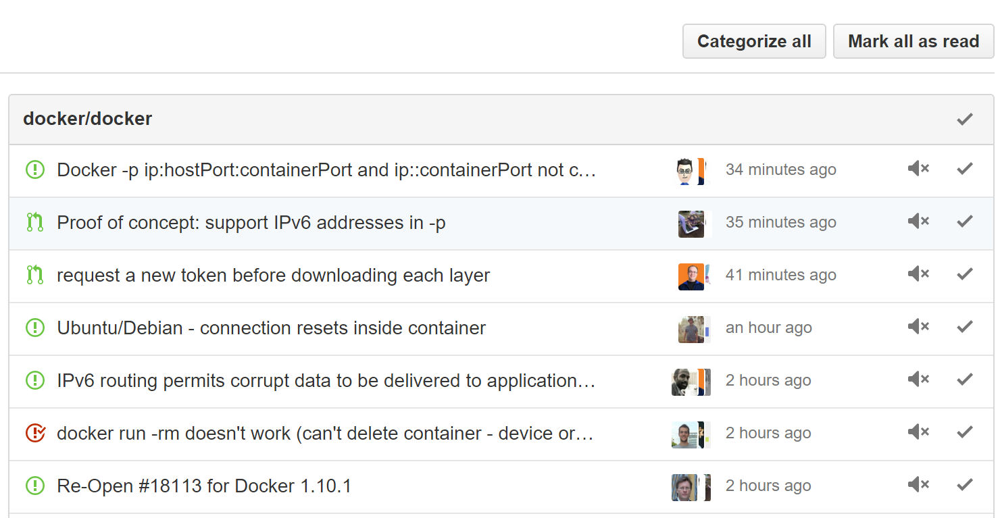

= GitHub Categoric

**A Chrome Extension that categorizes your GitHub notifications as "Pull Request", "Issues" and "Misc" per repository you watch.**

If you have a bunch of unread GitHub notifications and struggle to find your needs among them,  this extension can help you a bit by categorizing single-page notifications per repo. This tool tries to make your notifications more tidy. However, I don't know whether it is helpful or not, So I just created one to find out.

////
== Usage

1. Install extension from Chrome Web Store
2. Go to GitHub notification panel
3. Start categorizing your notification by clicking the "Categorize all" button
////

== Copyright

MIT License
